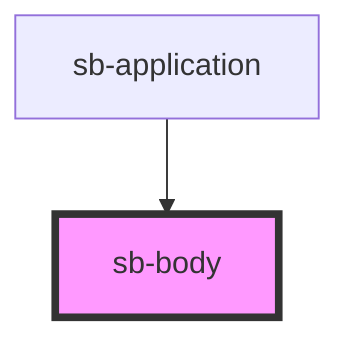

# sb-body

<!-- Auto Generated Below -->

## Overview

The main body of the book, containing the text

## Properties

| Property   | Attribute  | Description                                           | Type  | Default     |
| ---------- | ---------- | ----------------------------------------------------- | ----- | ----------- |
| `platform` | `platform` | The platform, functioning as a global key value store | `any` | `undefined` |

## Dependencies

### Used by

 - [sb-application](../application)

### Graph

----------------------------------------------

*Built with [StencilJS](https://stenciljs.com/)*
