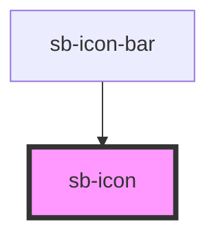

# sb-icon

<!-- Auto Generated Below -->

## Overview

A wrapper for material icons

## Properties

| Property | Attribute | Description         | Type                                     | Default     |
| -------- | --------- | ------------------- | ---------------------------------------- | ----------- |
| `icon`   | --        | Icon to be rendered | `{ name: IconName; color?: IconColor; }` | `undefined` |

## Dependencies

### Used by

 - [sb-icon-bar](../sidebar)

### Graph

----------------------------------------------

*Built with [StencilJS](https://stenciljs.com/)*
