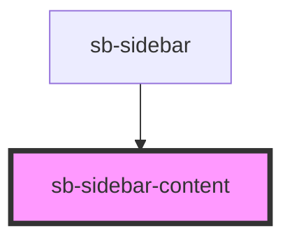

# navigation-bar

<!-- Auto Generated Below -->

## Properties

| Property | Attribute | Description                                 | Type                     | Default     |
| -------- | --------- | ------------------------------------------- | ------------------------ | ----------- |
| `mode`   | `mode`    | The current navigation mode to be displayed | `"contents" \| "search"` | `undefined` |

## Dependencies

### Used by

 - [sb-sidebar](.)

### Graph

----------------------------------------------

*Built with [StencilJS](https://stenciljs.com/)*
