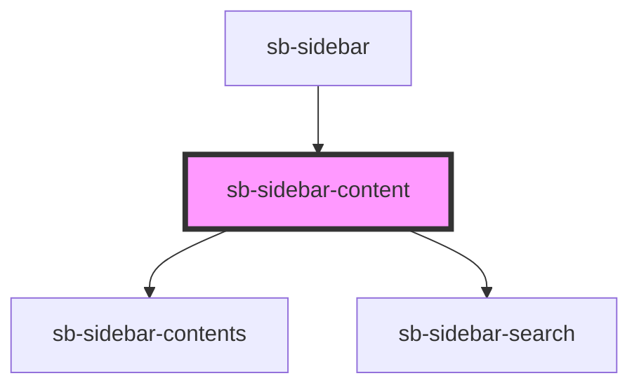

# navigation-bar

<!-- Auto Generated Below -->

## Properties

| Property   | Attribute | Description                                           | Type                     | Default     |
| ---------- | --------- | ----------------------------------------------------- | ------------------------ | ----------- |
| `mode`     | `mode`    | The current navigation mode to be displayed           | `"contents" \| "search"` | `undefined` |
| `platform` | --        | The platform, functioning as a global key value store | `Platform`               | `undefined` |

## Dependencies

### Used by

 - [sb-sidebar](.)

### Depends on

- [sb-sidebar-contents](sidebar-modes)
- [sb-sidebar-search](sidebar-modes)

### Graph

----------------------------------------------

*Built with [StencilJS](https://stenciljs.com/)*
